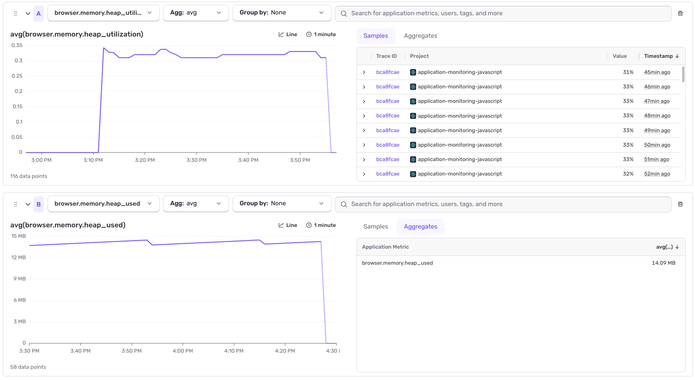

# Browser Heap Metrics with Sentry — Reference Implementation

A worked example of instrumenting **browser JS heap usage** as a custom Sentry
metric, so you can chart memory over a session and catch gradual growth (the
"app gets sluggish over a long session" problem).

> **This is not a runnable app.** It is three source files you read and copy
> from. There is no `package.json`, no build, nothing to `npm start`. The files
> are written the way they'd sit inside a real React app (`@sentry/react` +
> `react-router-dom`), so you can see exactly where each piece plugs in — but
> you lift the parts you need into *your* codebase. See **"How this maps to your
> app"** at the bottom.

---



*What it looks like in Sentry: the two gauges in the Application Metrics view —
`browser.memory.heap_utilization` (top) and `browser.memory.heap_used` (bottom).
Each sample carries a trace ID, so you can jump straight to the trace that was
running when the reading was taken.*

## The one line that matters

Everything here exists to support a single call:

```js
Sentry.metrics.gauge('browser.memory.heap_used', usedBytes, {
  unit: 'byte',
  attributes: { /* ...labels you can filter and group by... */ },
});
```

A **gauge** records "the value right now." You read the heap from
`performance.memory.usedJSHeapSize` and hand it to `gauge()`. That's the whole
mechanic. Once you've got that, the only real questions are **where** you call
it, **how often**, and **how you label it** — which is what the rest of this is
about.

### Prerequisite: turn metrics on

```js
Sentry.init({
  // ...
  enableMetrics: true, // without this, Sentry.metrics.* is silently dropped
});
```

If this is missing, your `gauge()` calls succeed and nothing shows up. It's the
most common reason "my metric isn't there."

### Also turn Tracing on — you need it to make sense of the metrics

Metrics give you the *number* (heap climbed to 900 MB). **Tracing gives you the
*story*** (…during the "Onboarding flow", on the `/dashboard` navigation, while
this asset-upload request was in flight). The two are meant to be read together:
every metric the SDK emits already carries `trace_id` / `span_id`, so a heap
reading links straight to the trace that was running when it was taken. Without
tracing you get a curve with no explanation for its shape.

So set a non-zero `tracesSampleRate` and add the router tracing integration:

```js
import * as Sentry from '@sentry/react';
import {
  useEffect,
  useLocation,
  useNavigationType,
  createRoutesFromChildren,
  matchRoutes,
} from 'react-router-dom'; // (useEffect is from 'react')

Sentry.init({
  dsn: '<your-dsn>',

  tracesSampleRate: 1.0, // start at 1.0 to validate, then dial down (e.g. 0.1);
                         // metrics are NOT sampled, so the heap curve is unbroken
                         // at any rate

  tracePropagationTargets: ['localhost', /^https:\/\/yourapp\.com\/api/],

  integrations: [
    // route changes -> navigation transactions the heap readings attach to
    Sentry.reactRouterV6BrowserTracingIntegration({
      useEffect,
      useLocation,
      useNavigationType,
      createRoutesFromChildren,
      matchRoutes,
    }),
  ],

  enableMetrics: true,
});

// wrap your <Routes> so transitions are traced
const SentryRoutes = Sentry.withSentryReactRouterV6Routing(Routes);
```

> On **react-router v7**, swap in `reactRouterV7BrowserTracingIntegration`. If
> you're not on react-router at all, use the plain
> `Sentry.browserTracingIntegration()` — you still get pageload/navigation
> transactions, just without per-route names. See `src/index.js` for the full
> wiring in context.

### Why a metric and not a span attribute?

Application Metrics are **not subject to trace sampling**. At
`tracesSampleRate: 0.1` your traces are 10% of traffic, but the heap gauge is
recorded every time — so the curve stays unbroken. (We *also* stamp the reading
onto the active span as an attribute, so you can correlate a spike to the exact
trace. You get both views; they join on `trace_id` automatically.)

---

## Two places heap gets recorded (they work together)

There are **two independent techniques** here. You can use either or both — they
don't replace each other.

### Technique 1 — Always-on, on an interval  ·  `startHeapSampling()`

Call it **once**, right after `Sentry.init()`:

```js
startHeapSampling();
```

This takes a baseline reading at **app load**, then samples on a timer for the
life of the session (Sentry's recommended baseline is **~every 10 seconds** —
`DEFAULT_SAMPLE_INTERVAL_MS`), plus a final reading on `pagehide` so the curve
has an endpoint. This is your safety net: memory is always being charted, even
on pages you never explicitly instrumented.

### Technique 2 — Labelled boundaries  ·  `<MemoryMetrics />`

A **render-nothing component** (`return null`) you mount inside your router. It
renders nothing — it exists only so React's lifecycle gives you clean "enter"
and "leave" hooks to sample on. In the reference app it lives inside
`<BrowserRouter>`, next to `ScrollToTop`, and takes a reading on every route
transition (`route_enter`, `route_settled`, `route_leave`).

This is the **additional** place readings happen. Technique 1 gives you an even
heartbeat; Technique 2 gives you readings pinned to meaningful moments and
labels them so the journey shows up as a labelled series instead of one flat
line.

> **You are usually not measuring "a route."** Route changes are just a
> convenient trigger. A long-lived dashboard is a *single* route that lives for an
> hour — routes tell you nothing there. So don't feel boxed into per-route: mount
> `<MemoryMetrics flow="..." />` around a flow's subtree, or **call
> `recordHeapSample()` / `recordFlowCheckpoint()` directly throughout your user
> flows** — at whatever points actually matter to you.

---

## Labelling by flow (the important part)

A raw heap curve tells you memory grew. It doesn't tell you *during what*. Tag
each reading with the **flow** it belongs to — the high-level thing the user is
doing — e.g. `"Dashboard session"` or `"Onboarding flow"`.

Set the flow once at its entry point and every reading taken while it's active
(including the interval readings) inherits it:

```js
import { setActiveFlow, clearActiveFlow } from './utils/memoryMetrics';

setActiveFlow('Onboarding flow');   // user enters the flow
// ...user does the thing; interval samples are now tagged flow="Onboarding flow"...
clearActiveFlow();                     // flow completes or is abandoned
```

or scope it to a subtree with the component:

```jsx
{isDashboardOpen && <MemoryMetrics flow="Dashboard session" />}
```

**In the Sentry UI:** build a dashboard widget on `browser.memory.heap_used` and
**Group By `flow`**. You get one line per flow — a clean comparison of which
journeys grow memory and which stay flat. One widget per flow, or one widget
grouped by flow, whichever you prefer.

### Sub-elements within a flow

Once you can *see* a flow, you'll want to know *where inside it* the growth
happens. Add a `checkpoint` for sub-steps — still the same metric, just a finer
label:

```js
import { recordFlowCheckpoint } from './utils/memoryMetrics';

recordFlowCheckpoint('Onboarding flow', 'step_1_completed');
recordFlowCheckpoint('Onboarding flow', 'data_loaded');
recordFlowCheckpoint('Onboarding flow', 'view_rendered');
```

Now you know the reading was part of the overall flow **and** which step it was.
GroupBy `flow` for the big picture; add or switch to `checkpoint` to drill into
one flow's internals.

---

## Two ways to encode the flow — attribute vs. metric name

You have a choice about *how* the flow lives in the data. Same reading, two
shapes:

**A — Flow as an attribute (recommended).** One metric name, flow is a label:

```js
Sentry.metrics.gauge('browser.memory.heap_used', usedBytes, {
  unit: 'byte',
  attributes: { flow: 'Onboarding flow' },
});
```
- ✅ One metric to chart, alert on, and **GroupBy `flow`** across every journey.
- ✅ Add flows anytime without new metric names.
- Use this unless you have a specific reason not to.

**B — Flow baked into the metric name.** A separate series per flow:

```js
Sentry.metrics.gauge('browser.memory.heap_used.onboarding_flow', usedBytes, {
  unit: 'byte',
});
```
- ✅ Dead-simple single-flow dashboards; each flow is its own named series.
- ⚠️ You can't GroupBy one metric across flows, and metric names multiply.
- Provided as `recordHeapSampleNamedByFlow()` in `memoryMetrics.js` so you can
  compare the two side by side.

---

## Call to action — instrument your flows deliberately

Don't sprinkle `gauge()` at random. For each user flow that matters, decide
three things:

1. **When is the flow initiated?** → `setActiveFlow('...')` (or mount
   `<MemoryMetrics flow="..." />`).
2. **What are the checkpoints inside it?** → `recordFlowCheckpoint(flow, step)`
   at each meaningful step.
3. **When is it complete (or abandoned)?** → `clearActiveFlow()`.

And underneath all of it, **keep Technique 1 running at all times on an
interval** so nothing goes unmeasured — then **tag what the flow is**, either as
an attribute (A) or in the metric name (B). The difference in code:

```js
// Attribute approach — one metric, grouped by flow (recommended)
setActiveFlow('Onboarding flow');
startHeapSampling();      // every interval reading now carries flow=Onboarding flow
// -> Sentry UI: chart browser.memory.heap_used, GroupBy flow

// Metric-name approach — a distinct series per flow
setInterval(
  () => recordHeapSampleNamedByFlow('onboarding_flow', { phase: 'interval' }),
  10000
);
// -> Sentry UI: chart browser.memory.heap_used.onboarding_flow directly
```

---

## What you'll see in Sentry

After a session or two with data flowing, in **Insights → Metrics** (or a
Dashboard widget):

1. **Pick the metric.** Search for `browser.memory.heap_used`. Set the
   visualization to the **avg** (or **max**, if you're hunting worst-case
   spikes) of the gauge value. Switch the Y-axis unit to bytes/MB.

2. **Group By `flow`.** The single line splits into one line per flow —
   e.g. `Onboarding flow`, `Dashboard session`. Now a flat line and a
   climbing line sit side by side, and it's obvious which journey leaks:

   ```
   heap_used (avg, MB)
    │                                   ╭─ Onboarding flow  (climbs — investigate)
    │                             ╭─────╯
    │                    ╭────────╯
    │        ╭───────────╯
    │  ──────┴──────────────────────────  Dashboard session  (flat — healthy)
    └────────────────────────────────────▶  session_elapsed_min
   ```

3. **Drill into one flow.** Filter to a single `flow`, then Group By
   `checkpoint` to see which sub-step (`step_1_completed`, `data_loaded`,
   …) the growth lands on.

4. **One widget per flow (optional).** Instead of grouping, add a Dashboard
   widget per flow with a `flow:"..."` filter, so each journey gets its own tile.

5. **Alert on utilization.** Build the alert on `browser.memory.heap_utilization`
   (percent) rather than raw bytes — the heap ceiling differs by device, so a
   percentage threshold (say, sustained > 80%) is portable across users.

> The `phase` attribute (`app_load` / `interval` / `route_enter` / …) is handy
> as a secondary filter — e.g. show only `interval` readings for the smooth
> baseline curve, or only `route_settled` to compare steady-state memory across
> pages.

## Files

| File | What it is |
|------|------------|
| `src/utils/memoryMetrics.js` | The core. Reads the heap, records the gauges, tags flow/checkpoint, and provides `startHeapSampling()` (interval) + `recordHeapSample()` / `recordFlowCheckpoint()` (manual). Start here. |
| `src/components/MemoryMetrics.jsx` | The render-nothing component for Technique 2 — route-scoped or flow-scoped. |
| `src/index.js` | A reference **excerpt** showing the three wiring points: import, `enableMetrics: true`, `startHeapSampling()`, and mounting `<MemoryMetrics />`. Not a full entry file. |

## Metrics emitted

| Metric | Unit | Meaning |
|--------|------|---------|
| `browser.memory.heap_used` | byte | `performance.memory.usedJSHeapSize` — the series you chart. |
| `browser.memory.heap_utilization` | percent | used ÷ heap ceiling. Easier to alert on; the ceiling varies by device. |

Common attributes on each: `flow`, `checkpoint`, `phase`
(`app_load` / `interval` / `route_enter` / `route_settled` / `route_leave` /
`pagehide` / `checkpoint`), `route`, `session_elapsed_min`.

## How this maps to your app

- Copy `memoryMetrics.js` and (optionally) `MemoryMetrics.jsx` into your source
  tree, matching your own folder layout.
- Add `enableMetrics: true` to your existing `Sentry.init(...)`.
- Call `startHeapSampling()` once, right after init.
- Decide your flows and drop in `setActiveFlow` / `recordFlowCheckpoint` at the
  points that matter — or mount `<MemoryMetrics flow="..." />`.
- Confirm `@sentry/react` is a recent version that exposes `Sentry.metrics`.

## Caveat — Chromium only

`performance.memory` exists only in Chromium (Chrome/Edge). Firefox and Safari
return nothing and the module **no-ops** after logging one warning — your app is
unaffected, you just won't get heap data there. The cross-browser API,
`performance.measureUserAgentSpecificMemory()`, requires COOP+COEP cross-origin
isolation, which is a heavier lift.

## Handy for demos

Add `?heapInterval=1000` to the URL to sample every second instead of every 10,
so a curve appears in Sentry without waiting.

---

## Browser Profiling

**Got the above running? Let us know and we'll add the config for Browser
Profiling.** Profiling captures function-level CPU samples, so you can go from
"this route is slow / memory grew here" to "*this function* is the cost" — the
natural next layer once heap metrics point you at a suspect flow.

One deliberate sequencing note: your app is already a heavy JavaScript
application with real performance concerns, and Profiling adds its own runtime
and data overhead on top of tracing. So **benchmark first**: confirm you can run
Sentry **Tracing** and capture these **heap metrics** cleanly — stable, no
noticeable overhead, data landing as expected — *before* layering Profiling on
top. Prove the base is solid, then add depth.

**Session Replay — avoid for now (same reasoning).** Replay is comparatively
heavy on the client (DOM recording, network capture) and, for a performance-
sensitive app like this, it's the wrong thing to add while you're still
establishing a clean tracing + metrics baseline. Get Tracing + Metrics
validated first; we can revisit Replay later if there's a specific need.

**Recommended order:** Metrics + Tracing (this package) → benchmark & validate →
Browser Profiling → (only if needed, later) Session Replay.
